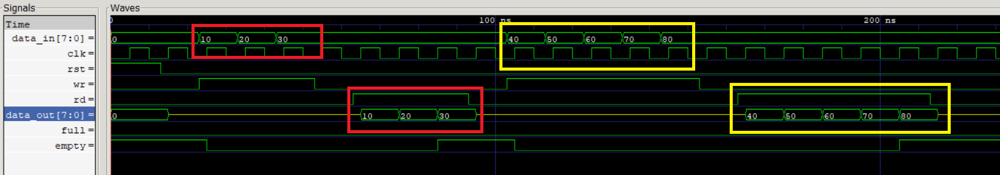
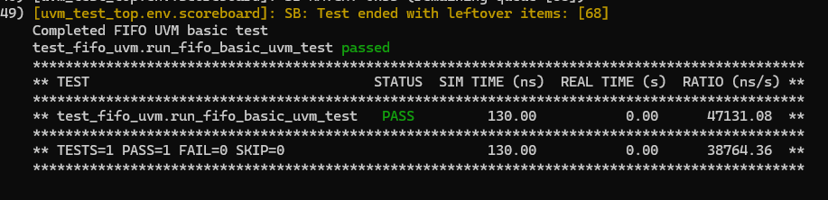

  
  
  
  

# Synchronous FIFO (First-In-First-Out) Buffer

---

## Project Overview

This project implements a **synchronous FIFO** buffer in Verilog. FIFO memory structures are essential for temporary data storage in hardware pipelines, inter-module communication, and clock domain crossing (with asynchronous variants). The FIFO operates with **parameterized depth and width**, making it flexible for a variety of use-cases.

---

## Concept

* **FIFO (First-In-First-Out)**: Data is written into the FIFO and read out in the exact order it was written.  
* **Synchronous**: Both read and write operations are clocked by the **same clock** signal.  
* **Pointer-Based**: Read and write pointers track positions.  
* **Flags**: `full` and `empty` status flags are maintained.

---

## Implementation Details

* **Reset** clears all flags and pointers.  
* Write (`wr`) and Read (`rd`) are **separate enables**.  
* When writing, data is stored and the write pointer increments.  
* When reading, data is output and the read pointer increments.  
* `data_out` is `zz` (high impedance) when no read is active.

---

## Repository Structure
tree
project_root/
│
├── src/                         # RTL design files
│   ├── fifo.v
│   └── ...
│
├── tb/                          # Pure Verilog functional testbenches
│   ├── fifo_tb.v
│   └── ...
│
├── sim/                         # Cocotb + pyuvm verification environment
│   ├── Makefile
│   ├── test_fifo_smoke.py
│   ├── test_fifo_uvm.py
│   ├── uvm_env/
│   │     ├── fifo_item.py
│   │     ├── fifo_driver.py
│   │     ├── fifo_monitor.py
│   │     ├── fifo_sequences.py
│   │     ├── fifo_scoreboard.py
│   │     ├── fifo_agent.py
│   │     ├── fifo_env.py
│   │     └── fifo_tests.py
│   │
│   ├── sim_build/               # Verilator output (auto-generated)
│   └── __pycache__/             # Python cache files
│
├── run_sim.sh                   # Script for running RTL and UVM simulations
│
└── README.md
undefined
---

## 🧪 Output Waveform

### ⏱️ Behavioral Transition Summary 

This table outlines critical FIFO transitions with clear commentary based on the waveform behavior.

| Time (ns) | rst | wr | rd | data_in | data_out | full | empty | Explanation                         |
| --------- | --- | -- | -- | ------- | -------- | ---- | ----- | --------------------------------- |
| 0         | 1   | 0  | 0  | 0       | 0        | 0    | 1     | Reset asserted — FIFO is cleared  |
| 13        | 0   | 0  | 0  | 0       | 0        | 0    | 1     | Reset deasserted — FIFO is empty  |
| 23        | 0   | 1  | 0  | 10      | zz       | 0    | 1     | First write of 10 initiated       |
| 25        | 0   | 1  | 0  | 10      | zz       | 0    | 0     | 10 committed — FIFO no longer empty |
| 33        | 0   | 1  | 0  | 20      | zz       | 0    | 0     | Write 20                         |
| 43        | 0   | 1  | 0  | 30      | zz       | 0    | 0     | Write 30                         |
| 53        | 0   | 0  | 0  | 30      | zz       | 0    | 0     | No operation                     |
| 63        | 0   | 0  | 1  | 30      | zz       | 0    | 0     | Read requested                   |
| 65        | 0   | 0  | 1  | 30      | 10       | 0    | 0     | Read outputs 10                  |
| 75        | 0   | 0  | 1  | 30      | 20       | 0    | 0     | Read outputs 20                  |
| 85        | 0   | 0  | 1  | 30      | 30       | 0    | 1     | Read outputs 30 — FIFO now empty |
| 103       | 0   | 1  | 0  | 40      | zz       | 0    | 1     | Write 40 initiated              |
| 105       | 0   | 1  | 0  | 40      | zz       | 0    | 0     | 40 committed                    |
| 113       | 0   | 1  | 0  | 50      | zz       | 0    | 0     | Write 50                       |
| 123       | 0   | 1  | 0  | 60      | zz       | 0    | 0     | Write 60                       |
| 133       | 0   | 1  | 0  | 70      | zz       | 0    | 0     | Write 70                       |
| 143       | 0   | 1  | 0  | 80      | zz       | 0    | 0     | Write 80                       |
| 153       | 0   | 0  | 0  | 80      | zz       | 0    | 0     | No operation                   |
| 163       | 0   | 0  | 1  | 80      | zz       | 0    | 0     | Read request                  |
| 165       | 0   | 0  | 1  | 80      | 40       | 0    | 0     | Read 40                       |
| 175       | 0   | 0  | 1  | 80      | 50       | 0    | 0     | Read 50                       |
| 185       | 0   | 0  | 1  | 80      | 60       | 0    | 0     | Read 60                       |
| 195       | 0   | 0  | 1  | 80      | 70       | 0    | 0     | Read 70                       |
| 205       | 0   | 0  | 1  | 80      | 80       | 0    | 1     | Read 80 — FIFO empty again    |

> `zz` indicates high impedance output when read is not asserted.

---

### VCD/Waveform Analysis

The VCD file shows FIFO working correctly:

* Writes happen sequentially, and data is held until reads occur.  
* Read data matches the order of written values.  
* Flags `full` and `empty` change accurately based on buffer usage.

---
## Synthesized FIFO Schematic

To demonstrate the synthesizability of the FIFO design, a gate-level schematic was generated post-synthesis using Vivado.

- The schematic confirms correct RTL-to-gate mapping.
- Key components such as counters, memory arrays, and control logic are correctly inferred.
- No latches or synthesis warnings were observed, indicating clean design practices.

[View FIFO Schematic (PDF)](images/schematic_FIFO.pdf)
## Verification Strategy

This project uses a two-layer verification strategy:

### 1. Functional Simulation (Traditional Testbench)
Baseline validation using:
- Icarus Verilog (simulation)
- GTKWave (waveform analysis)

Ensures correctness of:
- Reset logic
- Pointer increments
- FIFO full/empty detection
- Basic write/read functionality

### 2. UVM-Style Verification (pyuvm + Cocotb)
Advanced verification using:
- Python-based UVM components
- Randomized sequences
- Scoreboard checking
- Modular driver/monitor architecture

This method provides:
- Reusable components
- Better observability
- Constrained stimulus generation
- Automated checking

UVM Test Result:

The UVM environment successfully validated FIFO behavior using Verilator + Cocotb + pyuvm.

---
## Project Files

| File/Directory | Description |
|----------------|-------------|
| `src/`         | RTL modules including `fifo.v` and other design files |
| `tb/`          | Traditional Verilog testbenches such as `fifo_tb.v` |
| `sim/`         | Cocotb + pyuvm verification environment |
| `sim/Makefile` | Makefile for running Cocotb/Verilator-based simulations |
| `sim/test_fifo_smoke.py` | Simple sanity test (Cocotb) |
| `sim/test_fifo_uvm.py`   | UVM-style test using Cocotb + pyuvm |
| `sim/uvm_env/` | Complete UVM-style verification environment (driver, monitor, scoreboard, etc.) |
| `sim/sim_build/` | Auto-generated Verilator build folder *(not committed to git)* |
| `fifo.vcd` *(if applicable)* | Waveform dump generated by testbenches |

---

## Tools Used

| Tool / Framework     | Purpose |
|----------------------|---------|
| **Icarus Verilog**   | RTL simulation for simple Verilog testbenches |
| **GTKWave**          | Viewing `.vcd` waveform dumps |
| **Vivado**           | RTL synthesis, elaboration, and schematic generation |
| **Verilator**        | High-performance Verilog simulation and integration with Cocotb |
| **Cocotb**           | Python-based functional verification framework |
| **pyuvm**            | UVM-style verification library written in Python |
| **WSL2**             | Linux subsystem used to run Verilator + Cocotb toolchain |

---

## Sample FIFO Depth Calculation

Correctly sizing a FIFO is critical for maintaining data integrity and optimal system performance. Below are some key considerations:

- **Undersized FIFO:**
  - May lead to frequent overflows.
  - Causes loss of data during bursty or high-throughput input conditions.
  - Increases backpressure on upstream components.

- **Oversized FIFO:**
  - Wastes silicon area and power.
  - Increases latency unnecessarily.
  - Can complicate timing closure in high-speed designs.

Proper FIFO sizing is essential and should be based on system throughput, burst size, clock domain crossing considerations, and latency tolerance.

[See this PDF](images/Sample%20FIFO%20Depth%20calculations.pdf) for example calculations.

---

## Conclusion

This project confirms functional operation of a **parameterized synchronous FIFO**. It demonstrates a solid understanding of memory buffering, pointer control, flag generation, and simulation-driven debugging.

---

## Future Work

The next step is to implement an **asynchronous FIFO**, which allows reliable data transfer between two clock domains that are not synchronized. This involves using dual-clock logic, proper metastability handling (e.g., using Gray code pointers), and additional synchronizer stages to ensure safe read/write pointer comparisons. Asynchronous FIFOs are commonly used in systems like UARTs, network buffers, and DMA engines where clock domains differ.

---

## License

Open for educational and personal use under the [MIT License](License.txt)

